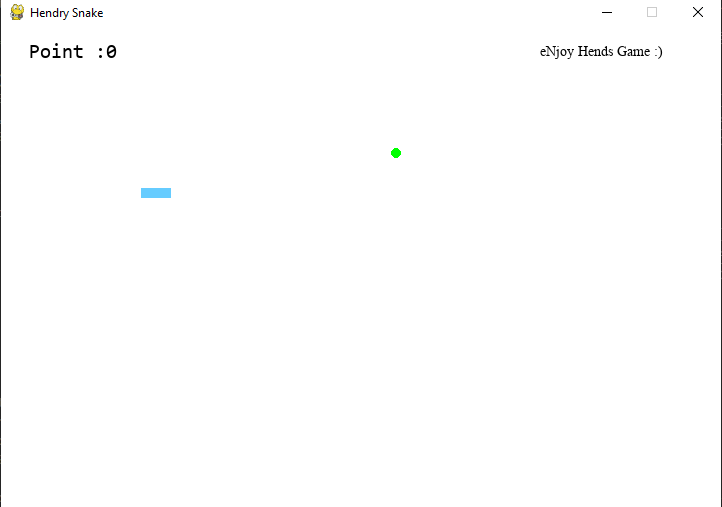

# Classic-Snake-Game-With-Python

Projek ini adalah hasil nostalgia terhadap game sewaktu kecil yaitu snake classic

Terdapat ular dan feed, dimana letak feed akan berubah ketika kepala ular berhasil bertemu feed.

ular akan bertambah panjang jika berhasil memakan feed 

kecepatan ular tersebutpun akan bertambah.

score awal yaitu 0, dan akan bertambah +1 jika berhasil memakan feed 

game over jika kepala ular bertemu bagian dari ular tersebut.

Berikut beberapa screenshot 

**Tampilan awal**

**Berhasil memakan**

**Game Over**

